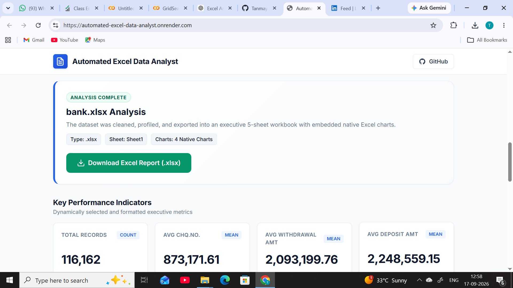
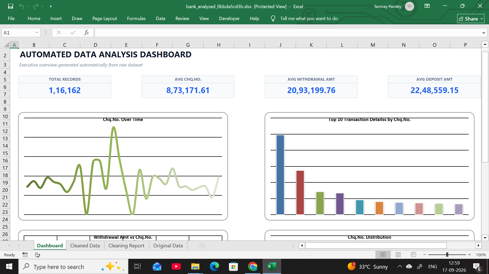
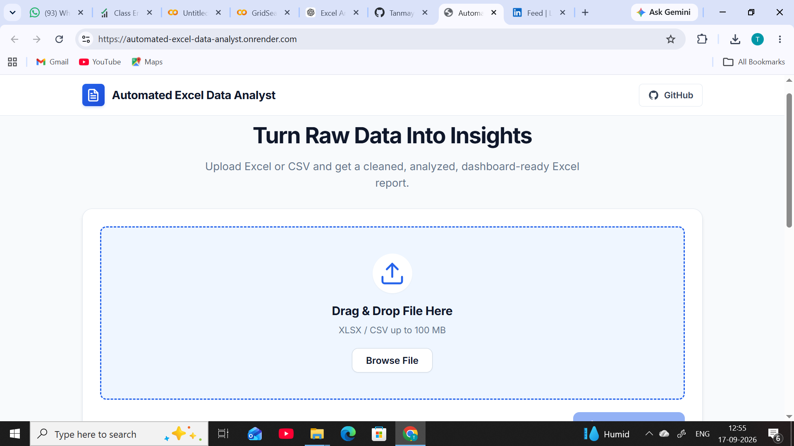

# Automated Excel Data Analyst

A full-stack automated data analytics application that transforms raw **Excel (`.xlsx`) and CSV (`.csv`) datasets** into cleaned, analyzed, and executive-ready Excel reports.

The system automatically validates uploaded files, selects the most relevant worksheet, cleans and profiles the data, detects semantic column roles, generates business KPIs and visualizations, and produces a downloadable multi-sheet Excel workbook.

---

## Live Demo

**Application:**  
https://automated-excel-data-analyst.onrender.com

> The application is deployed on Render. On the free hosting instance, the first request after a period of inactivity may take additional time while the service starts.

---
---

## Application Preview

### Home & File Upload

Upload Excel (`.xlsx`) or CSV (`.csv`) datasets through the web interface.



### Analysis Results

After processing, the application displays dataset statistics, automatically selected KPIs, generated chart information, and the option to download the final Excel report.



### Generated Excel Dashboard

The final downloadable Excel workbook contains an executive dashboard with automatically generated KPIs and native Excel charts.



---

## Project Overview

Business datasets often require several manual steps before useful insights can be generated:

- Cleaning missing or inconsistent values
- Removing duplicate records
- Identifying appropriate data types
- Selecting useful metrics
- Performing exploratory data analysis
- Creating charts and dashboards
- Preparing reports for decision-making

**Automated Excel Data Analyst** combines these steps into a single automated pipeline.

Users simply upload an `.xlsx` or `.csv` file through the web interface. The backend processes the dataset and generates an Excel workbook containing cleaned data, a cleaning audit report, business KPIs, and automatically selected charts.

---

## Key Features

### Excel & CSV Support
Processes both:

- `.xlsx`
- `.csv`

CSV ingestion supports multiple common encodings including UTF-8, UTF-8-SIG, Latin-1, and CP1252.

### Intelligent Excel Sheet Selection
For multi-sheet Excel workbooks, the system analyzes worksheet characteristics such as:

- Data density
- Number of rows
- Number of populated columns
- Header quality
- Worksheet naming

It then automatically selects the most suitable tabular worksheet for analysis.

### Automated Data Validation
The pipeline validates:

- File format
- File readability
- Dataset structure
- Missing values
- Duplicate records
- Column data types
- Column cardinality

### Smart Semantic Column Detection
Columns are automatically analyzed and classified into roles such as:

- Identifier
- Date / datetime
- Currency
- Percentage
- Count
- Rating
- Numeric measure
- Categorical attribute

The detector also protects duration-related columns such as `active_time`, `response_time`, and `hold_time` from being incorrectly interpreted as datetime values.

### Automated Data Cleaning
The cleaning engine can perform operations such as:

- Standardizing column names
- Normalizing missing-value representations
- Removing duplicate rows
- Converting percentage values
- Converting currency-formatted values
- Handling missing numeric values
- Handling missing categorical values
- Preserving identifier columns

### Exploratory Data Analysis
The EDA engine automatically generates statistical information including:

- Descriptive statistics
- Numeric distributions
- Categorical distributions
- Percentiles
- Correlation information
- Missing-value analysis

### Smart KPI Selection
The system automatically identifies business-relevant metrics and selects up to **4 KPIs** depending on the structure and semantic meaning of the uploaded dataset.

Possible KPI types include:

- Record counts
- Totals
- Averages
- Percentages
- Currency metrics
- Ratings
- Other dataset-specific measures

### Automatic Chart Selection
Up to **4 meaningful charts** can be selected based on the available columns and their distributions.

Supported visualization patterns include:

- Line charts
- Bar charts
- Top-N charts
- Pie charts
- Scatter plots
- Histograms

### Automated Excel Dashboard
The generated workbook includes native Excel charts and KPI summaries.

Because charts are generated directly inside the workbook, users can further modify or format them using Microsoft Excel.

### Cleaning Audit Report
Every generated workbook includes a cleaning report containing information such as:

- Original row count
- Cleaned row count
- Duplicate rows removed
- Missing values before cleaning
- Missing values after cleaning
- Data transformation summary

### Web-Based Interface
The application provides a responsive web interface with:

- Drag-and-drop file upload
- Processing feedback
- Analysis results
- KPI summaries
- One-click Excel report download

---

## How It Works

```text
User uploads XLSX / CSV
          |
          v
    File Validation
          |
          v
   Sheet Selection
     (XLSX only)
          |
          v
      Data Loading
          |
          v
   Dataset Validation
          |
          v
Semantic Column Detection
          |
          v
      Data Cleaning
          |
          v
Role Re-Detection
          |
          v
Exploratory Data Analysis
          |
          v
   Smart KPI Selection
          |
          v
  Smart Chart Selection
          |
          v
 Excel Report Generation
          |
          v
 Lightweight Output Validation
          |
          v
 Download Final XLSX Report
```

---

## Generated Excel Workbook

The final Excel report contains **5 worksheets**:

| Worksheet | Purpose |
|---|---|
| **Dashboard** | Executive KPIs, dataset summary, and automatically generated charts |
| **Cleaned Data** | Processed and cleaned dataset |
| **Cleaning Report** | Audit trail of cleaning and transformation operations |
| **Original Data** | Original/raw dataset or optimized raw-data preview for large files |
| **Chart Data** | Supporting data used for workbook visualizations |

---

## Technology Stack

### Backend
- Python
- FastAPI
- Uvicorn
- Python-Multipart

### Data Analysis
- Pandas
- NumPy
- SciPy

### Excel Processing
- OpenPyXL
- XlsxWriter

### Frontend
- HTML5
- CSS3
- JavaScript

### Testing
- Python Unittest
- Pytest
- FastAPI TestClient

### Deployment
- Render
- GitHub

---

## Project Structure

```text
automated_excel_data_analyst/
|
|-- data/
|   |-- input/
|   |   `-- .gitkeep
|   |
|   `-- output/
|       `-- .gitkeep
|
|-- src/
|   |-- __init__.py
|   |-- file_validator.py
|   |-- sheet_selector.py
|   |-- data_loader.py
|   |-- data_validator.py
|   |-- smart_column_detector.py
|   |-- data_cleaner.py
|   |-- eda_engine.py
|   |-- kpi_engine.py
|   |-- smart_kpi_selector.py
|   |-- kpi_formatter.py
|   |-- smart_chart_selector.py
|   |-- cleaning_report_generator.py
|   |-- dashboard_generator.py
|   |-- excel_exporter.py
|   |-- output_validator.py
|   `-- pipeline.py
|
|-- static/
|   |-- style.css
|   `-- script.js
|
|-- templates/
|   `-- index.html
|
|-- tests/
|   |-- generate_test_data.py
|   `-- test_pipeline.py
|
|-- api.py
|-- app.py
|-- requirements.txt
|-- README.md
`-- .gitignore
```

---

## Installation

### Prerequisites

Make sure you have:

- Python 3.10+
- pip
- Git

### 1. Clone the Repository

```bash
git clone https://github.com/Tanmayypandey/automated-excel-data-analyst.git
```

Move into the project directory:

```bash
cd automated-excel-data-analyst
```

### 2. Create a Virtual Environment

#### Windows

```powershell
python -m venv venv
venv\Scripts\activate
```

#### macOS / Linux

```bash
python3 -m venv venv
source venv/bin/activate
```

### 3. Install Dependencies

```bash
pip install -r requirements.txt
```

---

## Running the Application

Start the FastAPI server using:

```bash
uvicorn api:app --reload
```

Then open:

```text
http://127.0.0.1:8000
```

API documentation is available at:

```text
http://127.0.0.1:8000/docs
```

---

## Using the Application

1. Open the web application.
2. Upload an `.xlsx` or `.csv` dataset.
3. Start the analysis.
4. Wait while the automated pipeline processes the dataset.
5. Review the generated analysis and KPI information.
6. Download the final Excel workbook.
7. Open the workbook to explore the dashboard, cleaned data, cleaning report, and charts.

---

## API Endpoints

| Method | Endpoint | Description |
|---|---|---|
| `GET` | `/` | Loads the application web interface |
| `GET` | `/health` | Checks backend service health |
| `POST` | `/analyze` | Uploads and analyzes an XLSX or CSV dataset |
| `GET` | `/download/{filename}` | Downloads the generated Excel workbook |

### Example Health Check

```json
{
  "status": "healthy"
}
```

### Example Analysis Response

```json
{
  "status": "success",
  "message": "Data analysis completed successfully.",
  "original_filename": "sales.xlsx",
  "input_type": ".xlsx",
  "selected_sheet": "Sales Data",
  "charts_generated": 4,
  "output_filename": "sales_analyzed.xlsx",
  "download_url": "/download/sales_analyzed.xlsx"
}
```

---

## Large Dataset Handling

The application includes optimizations for processing larger datasets.

These include:

- Sample-based semantic column detection
- Efficient worksheet selection
- Reduced unnecessary cell-level Excel formatting
- Controlled raw-data export for large datasets
- Lightweight workbook output validation
- Memory-conscious workbook verification

For large inputs, the generated workbook may contain a limited preview of the raw dataset while retaining a larger cleaned-data export. This helps reduce workbook generation time and memory consumption.

Processing time depends on:

- Number of rows and columns
- XLSX vs CSV format
- Dataset complexity
- Hosting resources
- Number of generated charts

---

## Testing

Run the test suite with:

```bash
python -m unittest tests/test_pipeline.py
```

The project includes tests covering scenarios such as:

- Excel dataset processing
- CSV dataset processing
- Multi-sheet Excel selection
- Missing-value handling
- Duplicate removal
- Semantic column detection
- Numeric-heavy datasets
- Categorical-heavy datasets
- File validation
- FastAPI endpoints

---

## Security & Data Handling

The application does not require an external AI API or cloud database for the core analysis pipeline.

Uploaded datasets are processed by the application backend to generate the requested report.

Sensitive environment variables and generated input/output files are excluded from Git tracking through `.gitignore`.

> Do not upload confidential or sensitive business data to a public deployment unless the hosting and data-retention configuration is appropriate for your use case.

---

## Current Limitations

- Processing very large Excel workbooks can require significant memory and processing time.
- Performance depends on the resources available to the deployed server.
- The application currently analyzes one primary tabular worksheet from a workbook.
- Automatically selected KPIs and charts depend on the detected structure and semantic meaning of the dataset.
- Generated files stored on temporary hosting environments should not be treated as permanent storage.

---

## Future Enhancements

Planned improvements include:

- Multi-table worksheet detection
- Multi-sheet combined analysis
- More advanced chart recommendation logic
- User-selectable KPIs
- Custom dashboard themes
- Corporate Excel report templates
- Cloud/object storage integration
- Background processing for very large datasets
- Natural-language interaction with analyzed datasets

---

## Why I Built This Project

This project was developed to explore how **data engineering, automated analytics, business reporting, and full-stack development** can be combined into a single practical application.

It demonstrates experience with:

- Python automation
- Data cleaning
- Exploratory data analysis
- Business KPI generation
- Excel automation
- Backend API development
- Frontend integration
- Large-dataset optimization
- Deployment and debugging

---

## Author

**Tanmay Pandey**

Data Science | Machine Learning | Data Analytics | Python

GitHub:  
https://github.com/Tanmayypandey

LinkedIn:  
https://www.linkedin.com/in/tanmay-pandey-9b37bb278

---

## Support

If you find this project useful, consider giving the repository a star.

Feedback and suggestions for improving the project are welcome.